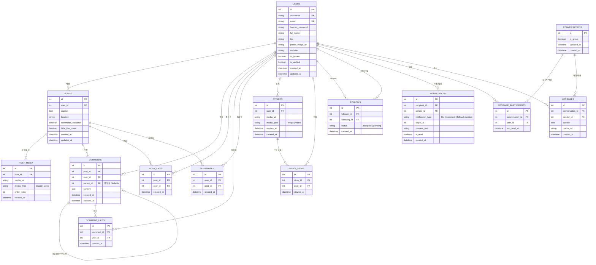

# 🗄️ Instagram 클론 데이터베이스 설계 명세서 (db.md)

## 1. 개요 (Overview)

본 문서는 React + FastAPI 기반 Instagram 클론 웹 애플리케이션의 데이터베이스 설계를 정의합니다.
경량성과 이식성을 고려하여 **SQLite 3**을 기본 데이터베이스로 채택하며, SQLAlchemy 2.0 ORM을 통해 스키마를 관리합니다.

### 1.1 기술 스펙
- **RDBMS**: SQLite 3 (`sqlite3`)
- **ORM**: SQLAlchemy 2.0+ (Declarative Base, Mapped & mapped_column)
- **마이그레이션 도구**: Alembic
- **SQLite 필수 설정 (FastAPI 엔진 초기화 시 적용)**:
  - `PRAGMA foreign_keys = ON;` (외래키 제약조건 강제)
  - `PRAGMA journal_mode = WAL;` (Write-Ahead Logging으로 동시 읽기/쓰기 성능 최적화)
  - `PRAGMA synchronous = NORMAL;`

---

## 2. ERD (Entity Relationship Diagram)



---

## 3. 테이블 상세 명세서

### 3.1 `users` (사용자 테이블)
| 컬럼명 | 타입 | Nullable | 기본값 | 제약조건 / 설명 |
|---|---|---|---|---|
| `id` | INTEGER | NO | AUTOINCREMENT | PK |
| `username` | VARCHAR(30) | NO | - | UNIQUE, 인스타그램 계정 ID (영문/숫자/밑줄) |
| `email` | VARCHAR(255) | NO | - | UNIQUE, 로그인 이메일 |
| `hashed_password` | VARCHAR(255) | NO | - | Bcrypt 암호화된 패스워드 |
| `full_name` | VARCHAR(100) | YES | NULL | 사용자 실명 또는 표시 이름 |
| `bio` | TEXT | YES | NULL | 150자 프로필 소개글 |
| `profile_image_url` | VARCHAR(500) | YES | NULL | 프로필 아바타 이미지 URL (미지정 시 기본 아바타) |
| `website` | VARCHAR(255) | YES | NULL | 프로필 링크 URL |
| `is_private` | BOOLEAN | NO | 0 | 비공개 계정 여부 (0: 공개, 1: 비공개) |
| `is_verified` | BOOLEAN | NO | 0 | 인증 배지 여부 |
| `created_at` | DATETIME | NO | CURRENT_TIMESTAMP | 계정 생성 일시 |
| `updated_at` | DATETIME | NO | CURRENT_TIMESTAMP | 정보 수정 일시 |

### 3.2 `follows` (팔로우 관계 테이블)
| 컬럼명 | 타입 | Nullable | 기본값 | 제약조건 / 설명 |
|---|---|---|---|---|
| `id` | INTEGER | NO | AUTOINCREMENT | PK |
| `follower_id` | INTEGER | NO | - | FK -> `users(id)` ON DELETE CASCADE (팔로우 요청자) |
| `following_id` | INTEGER | NO | - | FK -> `users(id)` ON DELETE CASCADE (팔로우 대상자) |
| `status` | VARCHAR(20) | NO | 'accepted' | 'accepted'(수락), 'pending'(비공개 계정 승인 대기) |
| `created_at` | DATETIME | NO | CURRENT_TIMESTAMP | 팔로우 생성 일시 |

- **복합 고유 제약조건 (Unique Constraint)**: `UNIQUE(follower_id, following_id)`
- **자가 참조 방지 제약**: `CHECK(follower_id != following_id)`

### 3.3 `posts` (게시물 테이블)
| 컬럼명 | 타입 | Nullable | 기본값 | 제약조건 / 설명 |
|---|---|---|---|---|
| `id` | INTEGER | NO | AUTOINCREMENT | PK |
| `user_id` | INTEGER | NO | - | FK -> `users(id)` ON DELETE CASCADE (작성자) |
| `caption` | TEXT | YES | NULL | 게시물 본문 (해시태그, 멘션 포함) |
| `location` | VARCHAR(255) | YES | NULL | 위치 정보 (예: 'Seoul, Korea') |
| `comments_disabled` | BOOLEAN | NO | 0 | 댓글 기능 비활성화 여부 |
| `hide_like_count` | BOOLEAN | NO | 0 | 좋아요 수 숨기기 여부 |
| `created_at` | DATETIME | NO | CURRENT_TIMESTAMP | 게시 일시 |
| `updated_at` | DATETIME | NO | CURRENT_TIMESTAMP | 수정 일시 |

### 3.4 `post_media` (게시물 미디어/캐러셀 테이블)
| 컬럼명 | 타입 | Nullable | 기본값 | 제약조건 / 설명 |
|---|---|---|---|---|
| `id` | INTEGER | NO | AUTOINCREMENT | PK |
| `post_id` | INTEGER | NO | - | FK -> `posts(id)` ON DELETE CASCADE |
| `media_url` | VARCHAR(500) | NO | - | 저장된 이미지/영상 파일 경로 또는 CDN URL |
| `media_type` | VARCHAR(20) | NO | 'image' | 'image' 또는 'video' |
| `order_index` | INTEGER | NO | 0 | 캐러셀 표시 순서 (0, 1, 2...) |
| `created_at` | DATETIME | NO | CURRENT_TIMESTAMP | 미디어 업로드 일시 |

- **인덱스**: `INDEX idx_post_media_post (post_id, order_index)`

### 3.5 `comments` (댓글 및 대댓글 테이블)
| 컬럼명 | 타입 | Nullable | 기본값 | 제약조건 / 설명 |
|---|---|---|---|---|
| `id` | INTEGER | NO | AUTOINCREMENT | PK |
| `post_id` | INTEGER | NO | - | FK -> `posts(id)` ON DELETE CASCADE |
| `user_id` | INTEGER | NO | - | FK -> `users(id)` ON DELETE CASCADE |
| `parent_id` | INTEGER | YES | NULL | FK -> `comments(id)` ON DELETE CASCADE (대댓글일 경우 부모 댓글 ID) |
| `content` | TEXT | NO | - | 댓글 내용 |
| `created_at` | DATETIME | NO | CURRENT_TIMESTAMP | 작성 일시 |
| `updated_at` | DATETIME | NO | CURRENT_TIMESTAMP | 수정 일시 |

- **인덱스**: `INDEX idx_comments_post (post_id, created_at)`

### 3.6 `post_likes` (게시물 좋아요 테이블)
| 컬럼명 | 타입 | Nullable | 기본값 | 제약조건 / 설명 |
|---|---|---|---|---|
| `id` | INTEGER | NO | AUTOINCREMENT | PK |
| `post_id` | INTEGER | NO | - | FK -> `posts(id)` ON DELETE CASCADE |
| `user_id` | INTEGER | NO | - | FK -> `users(id)` ON DELETE CASCADE |
| `created_at` | DATETIME | NO | CURRENT_TIMESTAMP | 좋아요 누른 일시 |

- **복합 고유 제약조건 (Unique Constraint)**: `UNIQUE(post_id, user_id)`

### 3.7 `comment_likes` (댓글 좋아요 테이블)
| 컬럼명 | 타입 | Nullable | 기본값 | 제약조건 / 설명 |
|---|---|---|---|---|
| `id` | INTEGER | NO | AUTOINCREMENT | PK |
| `comment_id` | INTEGER | NO | - | FK -> `comments(id)` ON DELETE CASCADE |
| `user_id` | INTEGER | NO | - | FK -> `users(id)` ON DELETE CASCADE |
| `created_at` | DATETIME | NO | CURRENT_TIMESTAMP | 좋아요 누른 일시 |

- **복합 고유 제약조건 (Unique Constraint)**: `UNIQUE(comment_id, user_id)`

### 3.8 `bookmarks` (저장된 게시물 테이블)
| 컬럼명 | 타입 | Nullable | 기본값 | 제약조건 / 설명 |
|---|---|---|---|---|
| `id` | INTEGER | NO | AUTOINCREMENT | PK |
| `user_id` | INTEGER | NO | - | FK -> `users(id)` ON DELETE CASCADE |
| `post_id` | INTEGER | NO | - | FK -> `posts(id)` ON DELETE CASCADE |
| `created_at` | DATETIME | NO | CURRENT_TIMESTAMP | 저장 일시 |

- **복합 고유 제약조건 (Unique Constraint)**: `UNIQUE(user_id, post_id)`

### 3.9 `stories` (24시간 스토리 테이블)
| 컬럼명 | 타입 | Nullable | 기본값 | 제약조건 / 설명 |
|---|---|---|---|---|
| `id` | INTEGER | NO | AUTOINCREMENT | PK |
| `user_id` | INTEGER | NO | - | FK -> `users(id)` ON DELETE CASCADE |
| `media_url` | VARCHAR(500) | NO | - | 스토리 미디어 URL |
| `media_type` | VARCHAR(20) | NO | 'image' | 'image' 또는 'video' |
| `expires_at` | DATETIME | NO | - | 만료 시점 (`created_at` + 24시간) |
| `created_at` | DATETIME | NO | CURRENT_TIMESTAMP | 등록 일시 |

- **인덱스**: `INDEX idx_stories_user_expires (user_id, expires_at)`

### 3.10 `story_views` (스토리 읽음 기록 테이블)
| 컬럼명 | 타입 | Nullable | 기본값 | 제약조건 / 설명 |
|---|---|---|---|---|
| `id` | INTEGER | NO | AUTOINCREMENT | PK |
| `story_id` | INTEGER | NO | - | FK -> `stories(id)` ON DELETE CASCADE |
| `user_id` | INTEGER | NO | - | FK -> `users(id)` ON DELETE CASCADE |
| `viewed_at` | DATETIME | NO | CURRENT_TIMESTAMP | 조회 일시 |

- **복합 고유 제약조건 (Unique Constraint)**: `UNIQUE(story_id, user_id)`

### 3.11 `notifications` (알림 테이블)
| 컬럼명 | 타입 | Nullable | 기본값 | 제약조건 / 설명 |
|---|---|---|---|---|
| `id` | INTEGER | NO | AUTOINCREMENT | PK |
| `recipient_id` | INTEGER | NO | - | FK -> `users(id)` ON DELETE CASCADE (알림 수신자) |
| `sender_id` | INTEGER | NO | - | FK -> `users(id)` ON DELETE CASCADE (행동 유발자) |
| `notification_type`| VARCHAR(30) | NO | - | 'like_post', 'like_comment', 'comment', 'follow', 'mention' |
| `target_id` | INTEGER | YES | NULL | 관련 post_id 또는 comment_id |
| `preview_text` | VARCHAR(255) | YES | NULL | 댓글 내용 미리보기 또는 설명 |
| `is_read` | BOOLEAN | NO | 0 | 읽음 상태 (0: 안읽음, 1: 읽음) |
| `created_at` | DATETIME | NO | CURRENT_TIMESTAMP | 알림 발생 일시 |

- **인덱스**: `INDEX idx_notifications_recipient (recipient_id, is_read, created_at)`

### 3.12 `conversations`, `message_participants`, `messages` (1:1 및 그룹 DM)
- **`conversations`**:
  - `id` (PK, INT)
  - `is_group` (BOOLEAN, 기본 0)
  - `updated_at` (DATETIME, 최근 메시지 전송 시각)
  - `created_at` (DATETIME)
- **`message_participants`**:
  - `id` (PK, INT)
  - `conversation_id` (FK -> conversations.id ON DELETE CASCADE)
  - `user_id` (FK -> users.id ON DELETE CASCADE)
  - `last_read_at` (DATETIME, 안읽은 메시지 수 계산용)
  - 복합 고유키: `UNIQUE(conversation_id, user_id)`
- **`messages`**:
  - `id` (PK, INT)
  - `conversation_id` (FK -> conversations.id ON DELETE CASCADE)
  - `sender_id` (FK -> users.id ON DELETE CASCADE)
  - `content` (TEXT, 텍스트 내용)
  - `media_url` (VARCHAR(500), 미디어 첨부 시)
  - `created_at` (DATETIME)
  - 인덱스: `INDEX idx_messages_conv_created (conversation_id, created_at)`

---

## 4. 인덱스(Index) 전략 요약

피드 탐색 및 조회 쿼리 성능을 유지하기 위해 다음 인덱스를 필수로 생성합니다.

```sql
-- 사용자 검색 및 팔로우 관계 최적화
CREATE INDEX idx_users_username ON users(username);
CREATE INDEX idx_follows_follower ON follows(follower_id, status);
CREATE INDEX idx_follows_following ON follows(following_id, status);

-- 피드 생성 쿼리 (내가 팔로우한 사용자들의 최근 게시물)
CREATE INDEX idx_posts_user_created ON posts(user_id, created_at DESC);

-- 포스트별 미디어 순서 로딩
CREATE INDEX idx_post_media_order ON post_media(post_id, order_index ASC);

-- 댓글 트리 로딩
CREATE INDEX idx_comments_post_parent ON comments(post_id, parent_id, created_at ASC);

-- 좋아요 수 및 중복 체크
CREATE INDEX idx_post_likes_post ON post_likes(post_id);
CREATE INDEX idx_comment_likes_comment ON comment_likes(comment_id);

-- 활성 스토리 필터링
CREATE INDEX idx_stories_active ON stories(expires_at DESC);
```

---

## 5. SQLAlchemy 2.0 모델 구현 가이드 예시

```python
from datetime import datetime
from typing import List, Optional
from sqlalchemy import (
    Integer, String, Text, Boolean, DateTime, ForeignKey, 
    UniqueConstraint, func, event
)
from sqlalchemy.orm import DeclarativeBase, Mapped, mapped_column, relationship
from sqlalchemy.engine import Engine

class Base(DeclarativeBase):
    pass

# SQLite 외래키 활성화 이벤트 리스너
@event.listens_for(Engine, "connect")
def set_sqlite_pragma(dbapi_connection, connection_record):
    cursor = dbapi_connection.cursor()
    cursor.execute("PRAGMA foreign_keys=ON")
    cursor.execute("PRAGMA journal_mode=WAL")
    cursor.close()

class User(Base):
    __tablename__ = "users"

    id: Mapped[int] = mapped_column(Integer, primary_key=True, autoincrement=True)
    username: Mapped[str] = mapped_column(String(30), unique=True, index=True, nullable=False)
    email: Mapped[str] = mapped_column(String(255), unique=True, index=True, nullable=False)
    hashed_password: Mapped[str] = mapped_column(String(255), nullable=False)
    full_name: Mapped[Optional[str]] = mapped_column(String(100), nullable=True)
    bio: Mapped[Optional[str]] = mapped_column(Text, nullable=True)
    profile_image_url: Mapped[Optional[str]] = mapped_column(String(500), nullable=True)
    website: Mapped[Optional[str]] = mapped_column(String(255), nullable=True)
    is_private: Mapped[bool] = mapped_column(Boolean, default=False)
    is_verified: Mapped[bool] = mapped_column(Boolean, default=False)
    created_at: Mapped[datetime] = mapped_column(DateTime, default=func.now())
    updated_at: Mapped[datetime] = mapped_column(DateTime, default=func.now(), onupdate=func.now())

    # 관계 정의
    posts: Mapped[List["Post"]] = relationship("Post", back_populates="author", cascade="all, delete-orphan")
    followers: Mapped[List["Follow"]] = relationship("Follow", foreign_keys="Follow.following_id", back_populates="following")
    following: Mapped[List["Follow"]] = relationship("Follow", foreign_keys="Follow.follower_id", back_populates="follower")
    bookmarks: Mapped[List["Bookmark"]] = relationship("Bookmark", back_populates="user", cascade="all, delete-orphan")
    stories: Mapped[List["Story"]] = relationship("Story", back_populates="user", cascade="all, delete-orphan")
```

---

## 6. 마이그레이션 및 시드 데이터 전략

1. **Alembic 환경 설정**:
   - `alembic init migrations`
   - `env.py`에서 `target_metadata = Base.metadata` 바인딩
   - SQLite는 `ALTER TABLE` 제약조건 변경에 한계가 있으므로, Alembic 설정 파일(`env.py`) 내에 `render_as_batch=True` 옵션을 활성화하여 마이그레이션 호환성을 보장합니다.
2. **시드 데이터 (Seeder)**:
   - 초기 개발 및 UI 확인을 위한 더미 계정 5개 (예: `@demo_user`, `@foodie_jenny`, `@travel_min`, `@tech_geek`, `@art_museum`)
   - 각 계정별 기본 프로필 사진, 스토리, 포스트(다중 이미지), 댓글 및 좋아요 관계 스크립트(`scripts/seed_db.py`) 제공
