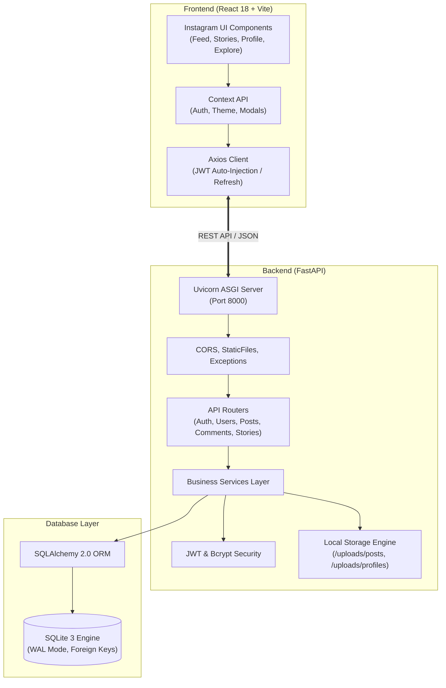

# 📖 Instagram 클론 전체 프로젝트 가이드 (guide.md)

## 1. 프로젝트 개요

본 프로젝트는 최신 모던 웹 기술 스택인 **React(Vite)**, **FastAPI**, **SQLite**를 기반으로 전 세계 20억 명이 사용하는 Instagram의 핵심 사용자 경험(피드, 다중 미디어 캐러셀, 스토리 뷰어, 팔로우, 좋아요/댓글, 북마크, 프로필)을 100% 동작 가능한 풀스택 웹 애플리케이션으로 구현하는 종합 개발 가이드입니다.

### 1.1 시스템 아키텍처 개요



---

## 2. 프로젝트 폴더 구조

전체 프로젝트는 하나의 루트 디렉터리 내에 프론트엔드와 백엔드가 명확히 격리된 모노레포 구조를 가집니다.

```
my_instagram/
├── backend/                   # FastAPI 백엔드 프로젝트
│   ├── app/
│   │   ├── main.py            # FastAPI 앱 진입점
│   │   ├── config.py          # 환경설정
│   │   ├── database.py        # DB 커넥션 및 세션
│   │   ├── core/              # 인증, 의존성, 예외처리
│   │   ├── models/            # SQLAlchemy 데이터 모델
│   │   ├── schemas/           # Pydantic 입출력 DTO
│   │   ├── services/          # 핵심 비즈니스 로직
│   │   └── routers/           # REST 엔드포인트
│   ├── uploads/               # 사용자 업로드 정적 파일
│   ├── scripts/               # 시드 데이터 및 배치 스크립트
│   ├── requirements.txt       # 파이썬 종속 패키지
│   ├── .env.example           # 백엔드 환경변수 템플릿
│   └── alembic/               # DB 마이그레이션
│
├── frontend/                  # React + Vite 프론트엔드 프로젝트
│   ├── public/                # 정적 에셋
│   ├── src/
│   │   ├── assets/            # 로고, 아이콘, 폰트
│   │   ├── components/        # 공통, 피드, 스토리, 프로필 컴포넌트
│   │   ├── contexts/          # Auth, Modal, Theme 전역 상태
│   │   ├── hooks/             # 커스텀 훅 (무한 스크롤, 제스처 등)
│   │   ├── pages/             # 페이지 컴포넌트 (홈, 탐색, 프로필 등)
│   │   ├── services/          # API 통신 모듈
│   │   ├── styles/            # 전역 CSS 및 디자인 토큰
│   │   ├── App.jsx            # 라우터 설정
│   │   └── main.jsx           # 리액트 진입점
│   ├── package.json           # Node.js 패키지 정의
│   ├── vite.config.js         # Vite 빌드 설정
│   └── .env.example           # 프론트엔드 환경변수 템플릿
│
├── db.md                      # 데이터베이스 설계 명세서
├── backend.md                 # 백엔드 개발 요청 명세서
├── front.md                   # 프론트엔드 개발 명세서
└── guide.md                   # 전체 프로젝트 가이드 (본 문서)
```

---

## 3. 개발 환경 사전 요구사항

- **OS**: Windows 10/11, macOS, 또는 Linux
- **Python**: Python 3.10 이상 (3.11 권장)
- **Node.js**: Node.js 18.x LTS 또는 20.x LTS
- **Package Manager**: npm (v9+)
- **Git**: 최신 버전

---

## 4. 백엔드(FastAPI) 설치 및 실행 가이드

### 4.1 가상환경 생성 및 활성화
터미널(PowerShell 또는 Bash)에서 `backend` 디렉터리로 이동 후 가상환경을 생성합니다.

```bash
cd d:\바이브코딩\my_instagran\backend

# 파이썬 가상환경 생성 (.venv)
python -m venv .venv

# 가상환경 활성화 (Windows PowerShell)
.venv\Scripts\Activate.ps1
# (또는 macOS/Linux: source .venv/bin/activate)
```

### 4.2 의존성 패키지 설치
`requirements.txt`에 정의된 패키지들을 설치합니다.

```bash
pip install --upgrade pip
pip install -r requirements.txt
```

#### 주요 필수 패키지 목록:
```text
fastapi>=0.110.0
uvicorn[standard]>=0.28.0
sqlalchemy>=2.0.28
pydantic>=2.6.4
pydantic-settings>=2.2.1
python-jose[cryptography]>=3.3.0
passlib[bcrypt]>=1.7.4
python-multipart>=0.0.9
pillow>=10.2.0
alembic>=1.13.1
```

### 4.3 환경 변수 설정
`backend/.env.example`을 복사하여 `.env` 파일을 생성합니다.

```ini
# backend/.env
PROJECT_NAME="Instagram Clone API"
SECRET_KEY="your-super-secret-jwt-key-generate-with-openssl-rand-hex-32"
ALGORITHM="HS256"
ACCESS_TOKEN_EXPIRE_MINUTES=60
REFRESH_TOKEN_EXPIRE_DAYS=14

# Database (SQLite)
DATABASE_URL="sqlite:///./instagram.db"

# CORS
BACKEND_CORS_ORIGINS=["http://localhost:5173", "http://127.0.0.1:5173"]

# Static File Uploads
UPLOAD_DIR="./uploads"
```

### 4.4 데이터베이스 초기화 및 시드 데이터 삽입
기본 테이블을 생성하고, 초기 테스트를 위한 5명의 목업 유저와 게시물, 스토리를 자동으로 채워 넣습니다.

```bash
python scripts/seed_db.py
```

### 4.5 백엔드 개발 서버 실행
```bash
uvicorn app.main:app --reload --host 0.0.0.0 --port 8000
```
- **API 서버 주소**: `http://localhost:8000`
- **대화형 Swagger 문서 (Swagger UI)**: `http://localhost:8000/docs`
- **ReDoc 문서**: `http://localhost:8000/redoc`

---

## 5. 프론트엔드(React + Vite) 설치 및 실행 가이드

새 터미널 창을 열고 `frontend` 디렉터리로 이동합니다.

### 5.1 패키지 의존성 설치
```bash
cd d:\바이브코딩\my_instagran\frontend
npm install
```

#### 주요 필수 의존성 목록:
```json
{
  "dependencies": {
    "react": "^18.2.0",
    "react-dom": "^18.2.0",
    "react-router-dom": "^6.22.3",
    "axios": "^1.6.8",
    "lucide-react": "^0.359.0"
  },
  "devDependencies": {
    "@vitejs/plugin-react": "^4.2.1",
    "vite": "^5.1.6"
  }
}
```

### 5.2 환경 변수 설정
`frontend/.env` 파일을 생성합니다.

```ini
# frontend/.env
VITE_API_BASE_URL=http://localhost:8000/api
VITE_MEDIA_BASE_URL=http://localhost:8000
```

### 5.3 프론트엔드 개발 서버 실행
```bash
npm run dev
```
- **프론트엔드 웹 애플리케이션 접속 주소**: `http://localhost:5173`

---

## 6. 단계별 개발 및 구현 로드맵 (Milestones)

| 마일스톤 | 핵심 목표 | 세부 작업 내용 |
|---|---|---|
| **Phase 1: 기반 환경 구축 & 인증** | 기초 프로젝트 골격 및 사용자 인증 완성 | - FastAPI 프로젝트 구조 초기화<br/>- SQLite DB 연결 및 `users`, `follows` 모델 생성<br/>- 회원가입, 로그인, JWT 발급/검증 API<br/>- 프론트엔드 Vite 설정, 라우터, 로그인/회원가입 폼 및 AuthContext 구현 |
| **Phase 2: 포스트 & 미디어 파이프라인** | 인스타그램 메인 피드의 핵심 작성/조회 흐름 완성 | - `posts`, `post_media` 모델 및 CRUD API<br/>- 파일 업로드 및 정적 서빙 엔드포인트 (`/uploads`)<br/>- 다단계 게시물 생성 모달(드래그앤드롭, 미리보기, 캡션)<br/>- 홈 피드 카드, 다중 이미지 캐러셀, 무한 스크롤 구현 |
| **Phase 3: 소셜 인터랙션 완성** | 좋아요, 댓글, 북마크, 팔로우 연동 | - `post_likes`, `comments`, `bookmarks` API 구현<br/>- 더블 탭 시 팝업 하트 애니메이션 및 좋아요 토글<br/>- 댓글 작성/대댓글 및 삭제 기능<br/>- 팔로우/언팔로우 버튼 및 프로필 상호작용 |
| **Phase 4: 탐색(Explore) & 24시간 스토리** | 몰입감 높은 부가 기능 구현 | - 탐색 3열 반응형 그리드 뷰 및 호버 오버레이<br/>- 스토리 등록 (24시간 만료) 및 상단 트레이 원형 아바타<br/>- 전체화면 스토리 뷰어(5초 자동 프로그레스 바, 탭 이동) |
| **Phase 5: UI 디테일 & 최종 검증** | 상용 수준의 마이크로 애니메이션 & 최적화 | - 다크 모드 / 라이트 모드 전환 테마 토큰 완성<br/>- 모바일 하단 탭바 및 반응형 미디어 쿼리 조정<br/>- E2E 사용자 플로우 테스트 및 성능 최적화 |

---

## 7. 주요 트러블슈팅 및 기술 FAQ

### Q1. SQLite "database is locked" 에러가 발생할 때
- **원인**: SQLite는 기본적으로 단일 파일 기반으로 동작하므로 여러 요청이 동시에 쓰기(Write)를 시도할 때 일시적 락이 걸릴 수 있습니다.
- **해결책**: 
  - `database.py`에서 `connect_args={"timeout": 15}`를 지정하여 락 대기 시간을 늘립니다.
  - 엔진 연결 시 `PRAGMA journal_mode=WAL;`을 적용하여 읽기와 쓰기 동시 수행을 가능하게 합니다.

### Q2. 프론트엔드 통신 시 CORS (Cross-Origin Resource Sharing) 에러
- **해결책**: `backend/app/main.py`의 `CORSMiddleware` 설정에서 `allow_origins=["http://localhost:5173"]`, `allow_credentials=True`, `allow_methods=["*"]`, `allow_headers=["*"]`를 명시적으로 등록합니다.

### Q3. 큰 용량의 이미지/동영상 업로드 시 서버 거부
- **해결책**: FastAPI 및 프론트엔드 양측에서 10MB 이상의 파일에 대해 사전 크기 유효성 검사를 수행하고, 업로드 전 클라이언트 측 캔버스(Canvas) 리사이징 또는 백엔드 Pillow 최적화 파이프라인을 통과시킵니다.
